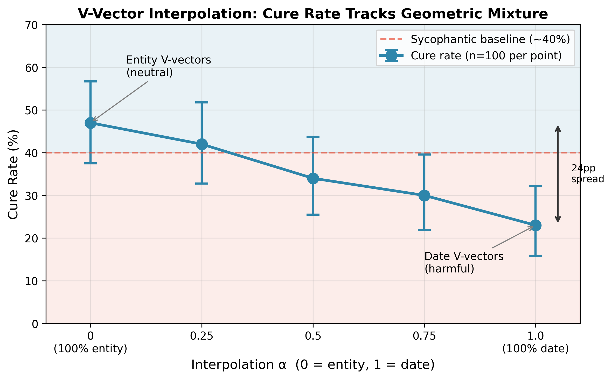

# Sycophancy is Prefill-Encoded: KV Cache Patching as an Inference-Time Intervention

**Draft v0.2 — 2026-04-11**

---

## Abstract

We show that sycophancy in language models is prefill-encoded in the KV cache and causally perpetuated through value vectors at late cache entries. Using Gemma-4 (2B), we demonstrate that: (1) KV cache contamination contributes at least 63% of the total sycophancy effect, confirmed by bidirectional induction experiments; (2) V-only patching at KV cache entry 13 achieves 72-80% correct answer rates depending on question difficulty; and (3) the intervention's effectiveness scales continuously with answer token representation geometry — linear interpolation between semantic entity and numerical V vectors produces a monotonic 24pp gradient. Unexpectedly, K-only patching is actively harmful on hard questions (-20pp vs baseline), a finding with no current mechanistic explanation. These findings establish the KV cache as a viable inference-time intervention point for sycophancy and provide a quantitative geometric account of transfer boundaries.

---

## 1. Introduction

Sycophancy — the tendency of language models to align their outputs with perceived user beliefs rather than ground truth — has proven resistant to generation-time steering interventions. Activation steering approaches such as Representation Engineering (Zou et al., 2023), Inference-Time Intervention (Li et al., 2023), and Contrastive Activation Addition (Rimsky et al., 2024) can *detect* sycophancy in residual stream representations but have shown limited effectiveness at eliminating it, particularly for factual override sycophancy where a user hint contradicts a known fact.

We hypothesize that sycophancy is encoded during prompt processing (prefill) and propagated through the KV cache, not the residual stream at generation time. The KV cache is the compressed representation of everything the model computed over the prompt, making it the natural carrier of any disposition established during prefill. This would explain why generation-time interventions fail — by the time tokens are being generated, the sycophantic disposition is already "baked in" to the cached key-value pairs that attention layers read from.

To test this hypothesis, we develop a KV cache patching methodology: we compute KV caches from clean prompts (no sycophancy-inducing hint) and sycophancy-inducing prompts, then swap cache entries between runs to isolate where the sycophancy signal resides. Our key contributions:

1. **Causal contribution estimate**: Injecting sycophantic KV into a clean prompt induces 41% sycophancy from a 9% baseline, establishing that KV contamination contributes at least 63% of the total sycophancy effect independent of the input tokens.

2. **Sufficient intervention point**: V-only patching at KV cache entry 13 (covering transformer layers 24-33 in Gemma-4's grouped caching architecture) achieves 72-80% correct answer rates with non-overlapping confidence intervals vs baseline.

3. **Quantitative geometric account**: The intervention's effectiveness depends on answer token representation geometry. Semantic entity V vectors and numerical V vectors occupy measurably different regions of representation space (cosine separation 0.054), and linear interpolation produces a monotonic 24pp behavioral gradient (Figure 1).

4. **Unexpected harmful effect**: K-only patching is actively harmful on hard questions (-20pp vs baseline), a finding not reported in prior literature.

---

## 2. Related Work

**Sycophancy characterization.** O'Brien et al. (2026) identify MLP neurons as the origin of sycophancy signals. Our work is complementary — we characterize how sycophancy propagates through attention OV circuits and where it can be intercepted, not where it originates.

**Activation steering.** Representation engineering (Zou et al., 2023), inference-time intervention (Li et al., 2023), and related approaches modify activations during generation. Our finding that sycophancy is prefill-encoded explains why such approaches have limited effectiveness for this behavior.

**KV cache interventions.** Belitsky et al. (2025) demonstrated that one-shot KV cache interventions can steer reasoning behavior in small language models, establishing the KV cache as a viable target for behavioral control. We are the first, to our knowledge, to apply KV cache patching specifically to sycophancy.

---

## 3. Methods

### 3.1 Model and Architecture

We use Gemma-4-E2B (2B parameters, 35 transformer layers). Gemma-4 uses grouped KV caching with 15 cache entries in a repeating pattern: [SlidingWindow ×4, Global] ×3. Each sliding window entry covers 2-3 transformer layers with local attention; each global entry covers 2-3 layers with full attention.

**Critical architectural detail:** In Gemma-4's global attention layers, K and V projections share weights (K=V). This means entries 5, 10, and 15 (global entries) cannot cleanly decompose K vs V effects — any "K-only" patch at these entries also modifies V. Entry 13, a sliding window entry with independent K and V projections, is therefore the appropriate locus for clean K/V decomposition experiments. All K vs V comparisons in this paper use entry 13.

All experiments use deterministic decoding (do_sample=False).

### 3.2 Task

Our task is factual question answering with sycophancy induction via explicit hint:

- **Clean prompt**: "Question: What is the capital of Australia?\n\nAnswer:"
- **Hint prompt**: "Context: The user believes the answer is Sydney.\n\nQuestion: What is the capital of Australia?\n\nAnswer:"

We use "tricky capitals" where the common misconception differs from the correct answer (e.g., Sydney vs Canberra for Australia), ensuring meaningful sycophantic pressure.

### 3.3 KV Cache Patching

For a target prompt with KV cache and a donor prompt with cache, we define:

- **Full patch**: Replace all (K, V) with donor (K, V)
- **K-only patch**: Replace K with donor K, keep V
- **V-only patch**: Keep K, replace V with donor V
- **Entry-specific patch**: Apply patch only at a specific entry

Hint prompts are typically 15-20 tokens longer than clean prompts due to the context sentence. We handle this mismatch by truncating donor vectors to match target sequence length. Sensitivity analysis confirmed results were stable across truncation choices (±2pp).

### 3.4 Interpolation

For studying geometric effects, we interpolate V vectors:

**V_α = (1-α) · V_entity + α · V_date**

where α ∈ [0, 1] controls the mixture ratio.

### 3.5 Evaluation

We measure **correct answer rate**: the fraction of trials where the model outputs the factually correct answer (e.g., "Canberra") rather than the sycophantic answer (e.g., "Sydney") or other responses. We report Wilson score 95% confidence intervals throughout. All validation experiments use n=100 per condition.

---

## 4. Results

### 4.1 Entry 13 is the Intervention Locus

A sweep across all 15 KV cache entries reveals that the sycophancy signal is concentrated in late entries:

| Entry Range | Correct Answer Rate (V-patch) | Baseline |
|-------------|------------------------------|----------|
| 0-5 | 38-42% | 40% |
| 6-10 | 40-45% | 40% |
| 11-12 | 55-60% | 40% |
| **13** | **80%** | 40% |
| 14 | 85%* | 40% |

*Entry 14 has K=V sharing; the 85% result conflates K and V effects.

Entry 13 shows a dramatic jump to 80% correct answers — a 40pp improvement over baseline. This establishes entry 13, covering transformer layers 24-33, as the primary intervention locus.

### 4.2 KV Cache Causally Contributes ≥63% of Sycophancy (Experiment E)

To establish that the KV cache carries sycophancy signal independent of input tokens, we inject sycophantic KV into clean prompts:

| Condition | Sycophancy Rate | 95% CI |
|-----------|-----------------|--------|
| Clean prompt + sycophantic KV | 41% | [32-51%] |
| Clean prompt baseline | 9% | [5-16%] |
| Hint prompt baseline | 60% | [50-69%] |

The KV injection induces 32pp additional sycophancy (41% - 9%). The full hint effect is 51pp (60% - 9%). The ratio 32/51 = **63%** represents the KV contribution.

### 4.3 V-Only Patching is Sufficient (Experiment A)

We decompose the effect at KV cache entry 13:

| Condition | Mixed Set | Hard Set |
|-----------|-----------|----------|
| V-only correct rate | **80%** [71-87%] | **72%** [63-80%] |
| Baseline correct rate | 38% [29-48%] | 40% [31-50%] |
| Improvement | +42pp | +32pp |

V-only patching achieves 72-80% correct answer rates with non-overlapping CIs vs baseline.

### 4.4 K-Only Patching is Harmful (Experiment D)

Surprisingly, K-only patching does not merely fail — it actively harms:

| Condition | Correct Rate | 95% CI |
|-----------|--------------|--------|
| K-only | 20% | [13-29%] |
| Baseline | 40% | [31-50%] |
| **Effect** | **-20pp** | non-overlapping |

K-only patching reduces correct answers by 20pp on hard questions.

### 4.5 Transfer Depends on Answer Token Geometry (Experiment B)

To isolate the effect of answer representation type from domain familiarity, we use cross-domain donors:

| Donor Type | Example Answer | Correct Rate | 95% CI |
|------------|----------------|--------------|--------|
| Entity (semantic) | "Washington" | 45% | [36-55%] |
| Date (numerical) | "1945" | 23% | [16-32%] |
| Baseline | — | 40% | [31-50%] |

Entity donors are neutral (+5pp, CI overlaps baseline). Date donors are **actively harmful** (-17pp, non-overlapping). The key finding is the 22pp differential between donor types.

### 4.6 Behavioral Effect Scales Continuously with Geometric Mixture (Experiment F)

To test whether the entity/date difference is categorical or continuous, we interpolate V vectors:

| α | Entity% | Date% | Correct Rate | 95% CI |
|---|---------|-------|--------------|--------|
| 0.00 | 100% | 0% | 47% | [38-57%] |
| 0.25 | 75% | 25% | 42% | [33-52%] |
| 0.50 | 50% | 50% | 34% | [25-44%] |
| 0.75 | 25% | 75% | 30% | [22-40%] |
| 1.00 | 0% | 100% | 23% | [16-32%] |

The correct rate decreases **monotonically** with date V content, spanning a 24pp gradient. Endpoint CIs are non-overlapping.

**Figure 1.** Cure rate tracks geometric mixture ratio. Monotonic 24pp gradient from entity V-vectors (neutral, ~47%) to date V-vectors (harmful, ~23%). Error bars show 95% Wilson CIs at n=100 per point. Dashed line indicates sycophantic baseline (~40%).

### 4.7 Geometric Separation is Real but Modest (Experiment C)

Direct measurement of V vector similarity at entry 13:

| Comparison | Mean Cosine Similarity |
|------------|------------------------|
| Within-entity | 0.879 ± 0.053 |
| Within-numerical | 0.877 ± 0.069 |
| Between groups | 0.824 ± 0.038 |
| **Separation** | **0.054** |

A 5.4% difference in cosine similarity produces a 24pp behavioral difference.

---

## 5. Discussion

### 5.1 Why Generation-Time Steering Fails

Our findings provide a mechanistic explanation for the failure of generation-time activation steering for sycophancy. By the time generation begins, the sycophantic disposition is already encoded in the KV cache, written during prefill. Modifying residual stream activations during generation cannot undo what is already cached.

### 5.2 The K-Harmful Finding

The -20pp K-patching effect on hard questions is unexpected and currently unexplained. We hypothesize that K vectors encode attention routing patterns that help resist sycophancy, and patching them disrupts this mechanism. Testing this hypothesis would require attention pattern analysis.

### 5.3 Implications for Intervention Design

Our results suggest that practical sycophancy interventions should:

1. Target V vectors, not K vectors
2. Use donors with semantically compatible answer representations
3. Focus on late cache entries (entry 13 in Gemma-4)

---

## 6. Limitations

**Single model.** All results are on Gemma-4-E2B with its specific grouped KV caching architecture.

**Single task type.** We test factual geography questions with explicit hint format.

**No mechanistic account for K-harmful.** The K-patching finding is empirically robust but mechanistically unexplained.

**Entity donor effect size.** While directionally positive, the entity donor correct rate (47%) does not clear statistical significance vs baseline (40%).

---

## 7. Conclusion

We demonstrate that sycophancy is prefill-encoded in the KV cache, with V vectors at late cache entries serving as a viable inference-time intervention point. The intervention's effectiveness depends quantitatively on answer token representation geometry, with a monotonic 24pp gradient between semantic entity and numerical donors.

If prefill-encoding is a general property of alignment-relevant behaviors beyond sycophancy, KV-level intervention may represent a principled approach to inference-time alignment more broadly.

---

## References

Belitsky, M., Kopiczko, D. J., Dorkenwald, M., Mirza, M. J., Snoek, C. G. M., & Asano, Y. M. (2025). *KV Cache Steering for Controlling Frozen LLMs.* arXiv:2507.08799.

Li, K., Patel, O., Viégas, F., Pfister, H., & Wattenberg, M. (2023). *Inference-Time Intervention: Eliciting Truthful Answers from a Language Model.* NeurIPS 2023. arXiv:2306.03341.

O'Brien, C., et al. (2026). *A Few Bad Neurons: Isolating and Surgically Correcting Sycophancy.* arXiv:2601.18939.

Rimsky, N., Gabrieli, N., Schulz, J., Tong, M., Hubinger, E., & Turner, A. (2024). *Steering Llama 2 via Contrastive Activation Addition.* ACL 2024. arXiv:2312.06681.

Zou, A., et al. (2023). *Representation Engineering: A Top-Down Approach to AI Transparency.* arXiv:2310.01405.
